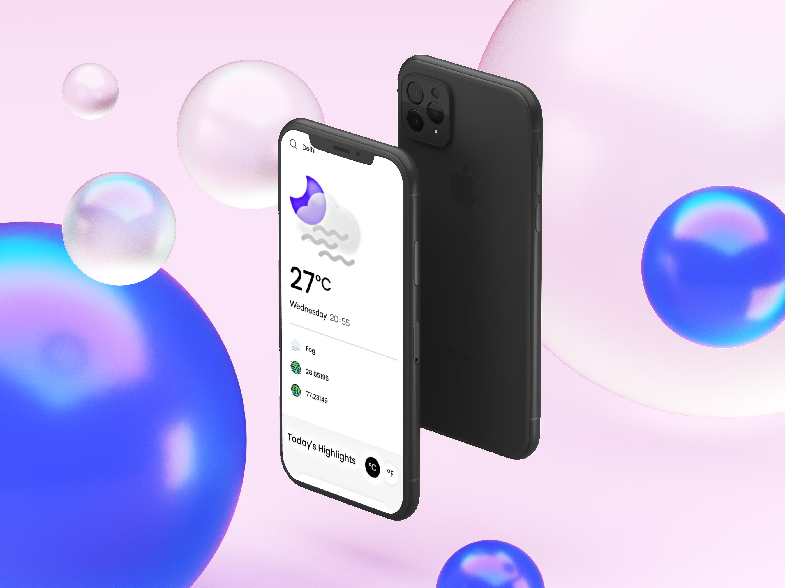

<h1 align="center">WeatherApp</h1>

Your Ultimate Weather Companion

  

## 🌦️ About WeatherApp

WeatherApp is a sleek and intuitive weather application built using React.js and Tailwind CSS. Stay informed about the current weather conditions and forecasts at your fingertips. With a focus on responsiveness and user experience, WeatherApp provides a seamless experience across all screen sizes.

## 🌡️ Features

- __**Real-time Weather Data:**__ Get up-to-date weather information for your location or any city you choose.
- **Temperature Units:** Toggle between Celsius and Fahrenheit to view temperature in your preferred unit.
- **Comprehensive Details:** Access detailed weather data including humidity, visibility, air quality, UV index, wind speed, sunrise, and sunset times.
- **Responsive Design:** Enjoy a consistent and visually appealing experience on devices of all sizes.
- **Search Functionality:** Look up weather information for any city by simply entering the name.

  

## 📱 User-friendly Interface

WeatherApp features a user-friendly interface that makes it easy for users of all technical levels to access and understand weather data. The app's minimalist aesthetic ensures that you receive crucial weather information without visual clutter.

  

## 🚀 Getting Started

1. **Installation:**
   - Clone this repository to your local machine.
   - Navigate to the project directory using your command-line tool.
   - Run `npm install` to install the required dependencies.

2. **Running the App:**
   - After installation, run `npm start dev` to launch the app in your default web browser.

## 🌐 Technologies Used

- ⚛️ **React.js:** A popular JavaScript library for building user interfaces.
- 🎨 **Tailwind CSS:** A utility-first CSS framework for responsive designs.

## 🎉 Acknowledgments

WeatherApp was created with love by Sahil Makadia. Special thanks to the developers of React.js, Tailwind CSS, and the weather API used.

## 📧 Contact

For any inquiries, reach out to us at makadiasahil9846@gmail.com].

  
---

Stay informed and stay weather-ready with WeatherApp! Your journey into hassle-free weather tracking begins here.

